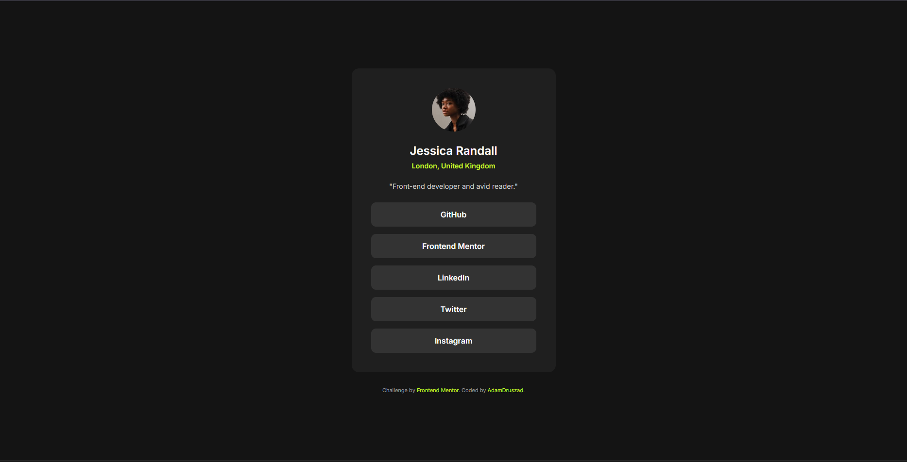

# Frontend Mentor - Social links profile solution

This is a solution to the [Social links profile challenge on Frontend Mentor](https://www.frontendmentor.io/challenges/social-links-profile-UG32l9m6dQ). Frontend Mentor challenges help you improve your coding skills by building realistic projects. 

## Table of contents

- [Overview](#overview)
  - [The challenge](#the-challenge)
  - [Screenshot](#screenshot)
  - [Links](#links)
- [My process](#my-process)
  - [Built with](#built-with)
  - [What I learned](#what-i-learned)
  - [Continued development](#continued-development)
  - [AI Collaboration](#ai-collaboration)
- [Author](#author)

## Overview

### The challenge

Users should be able to:
- See hover and focus states for all interactive elements on the page
- View the optimal layout for the interface depending on their device's screen size

### Screenshot

 

### Links

- Solution URL: https://github.com/AdamDruszad/Social_Link_Profiles
- Live Site URL: [Add your GitHub Pages live URL here]

## My process

### Built with

- Semantic HTML5 markup
- CSS custom properties (Variables)
- Flexbox
- Responsive CSS (Media Queries)
- Clean, structured architecture

### What I learned

Working on this project really solidified my understanding of CSS Flexbox and layout structuring. I learned how to properly center elements on the screen and how to handle default browser styles that can break layouts.

Here are a few CSS snippets I am proud of from this project:

**1. Perfectly centering the main card on the screen:**
I learned that using `min-height: 100vh` on the body along with Flexbox is the most robust way to center content vertically and horizontally.

```css
body {
  display: flex;
  flex-direction: column;
  justify-content: center;
  align-items: center;
  min-height: 100vh;
}
